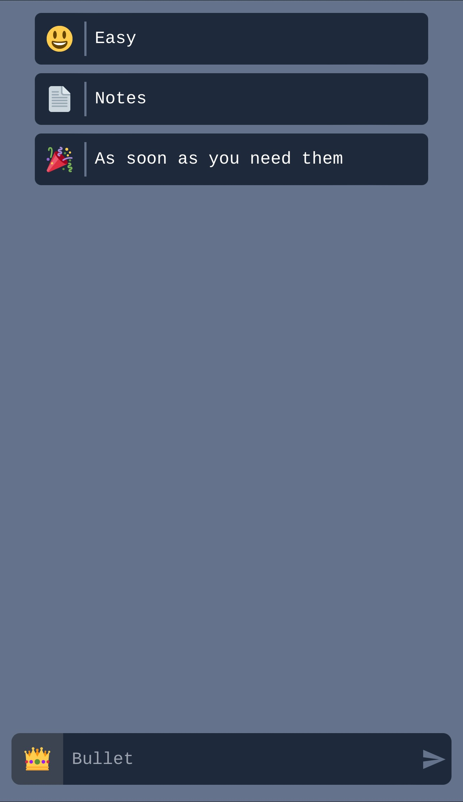

<h1>LostRabbit - a web app for quick notes</h1>

## Demo

LostRabbit is available _right now!_ at https://lost-rabbit.vercel.app/. It
works best when installed as a progressive web app, which can usually be done
using the "add to home screen" (or equivalent) option provided by your browser.

## Description

LostRabbit (real name coming soon) is a tiny journaling/notes app designed to be
as fast and minimal as possible but still nice to use. It envisions notes as
"bullets", a pairing of an emoji and some text content. It was inspired by the
<a href="https://bulletjournal.com/">bullet journal </a> note taking system.

A note on privacy: LostRabbit is very simple. All notes are saved to the
browser's localstorage, nothing is sent anywhere outside the device.

## Development

#### Dependencies

- node
- a node package manager

#### How to run

To install lostRabbit locally simply clone the repo, cd to the folder, and

> npm install

(or yarn or your preferred equivalent) to install required depencies. After this finishes, you can run it for local dev
using

> npm run dev

To build a production version, run

> npm run build

which will build the project in the `dist` folder.

## Built With (and thanks to)

- [React](https://react.dev)
- [Tailwind](https://tailwindcss.com)
- [Vite](https://vitejs.dev)
- [Vite-pwa](https://vite-pwa-org.netlify.app/)
- [Vercel](https://vercel.com)
- [Daisyui](https://daisyui.com)
- [react-twemoji](https://github.com/ZxMYS/react-twemoji) by [ZxMYS](https://github.com/ZxMYS)
- [react-twemoji-picker](https://github.com/BrianHung/EmojiPicker) by [Brian
  Hung](https://github.com/BrianHung)
